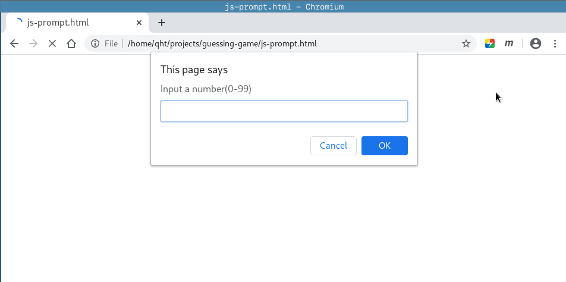
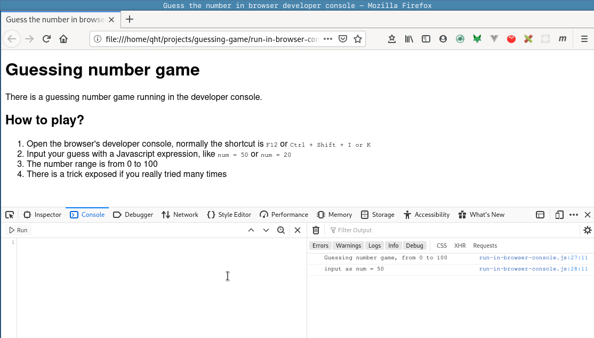
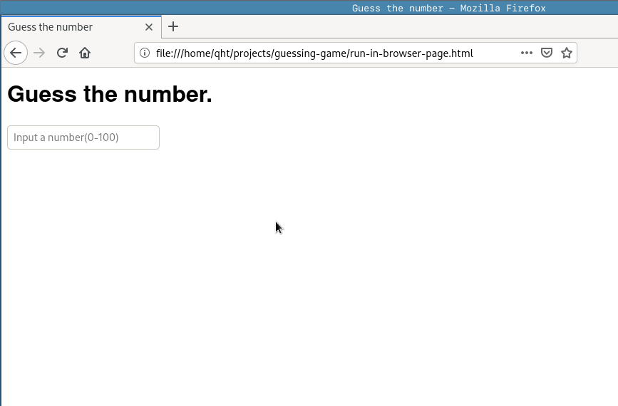
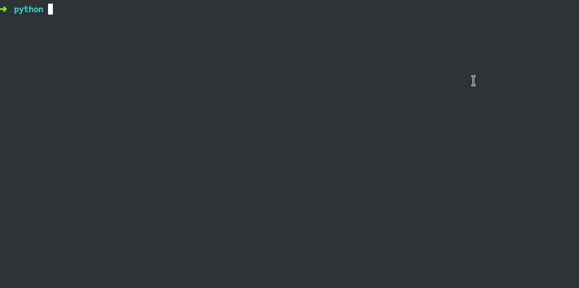
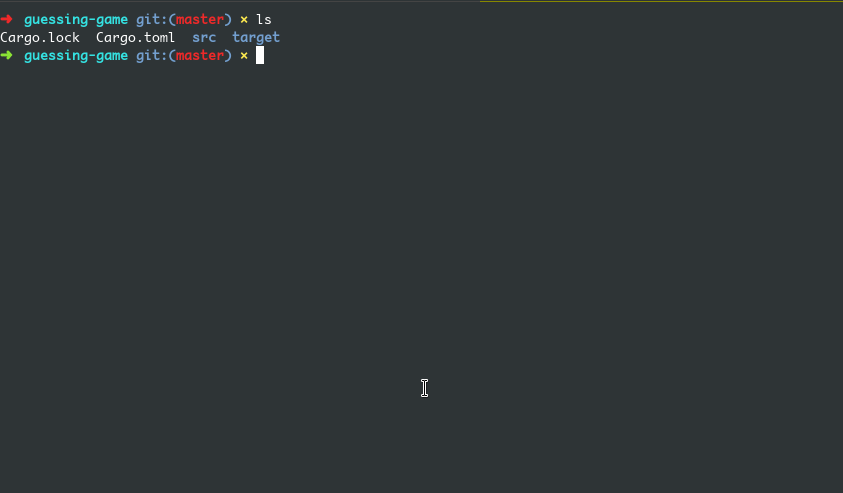

# Number Guessing game

This is a baby step toy project for fun.

This 0.0.1 version are just some runnable code.

Some gif:

1. using prompt as UI

2. using DevTools console

3. run in browser page, bare minimal UI

4. run in python

5. run in rust

